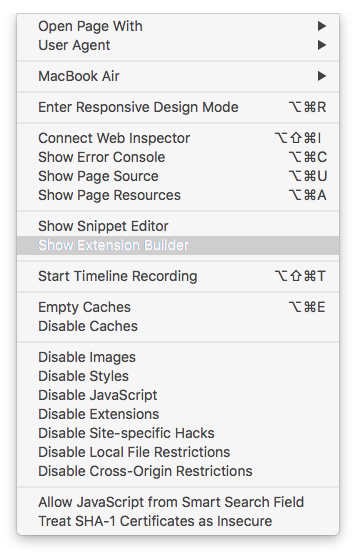
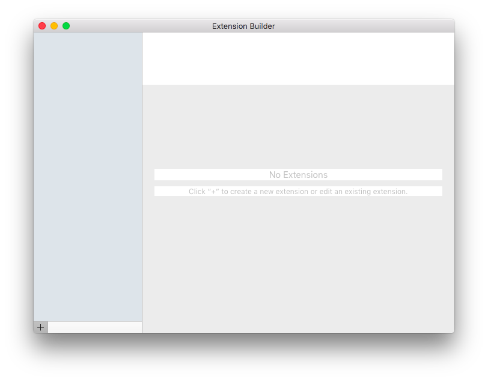
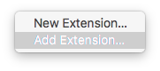
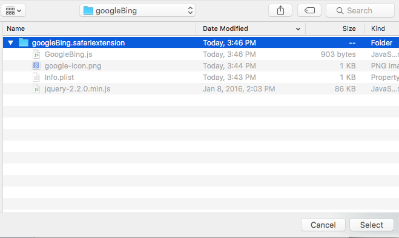
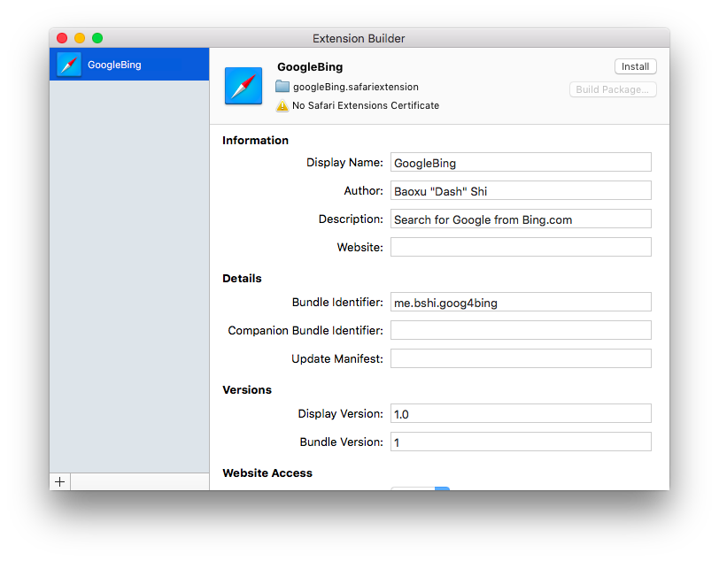
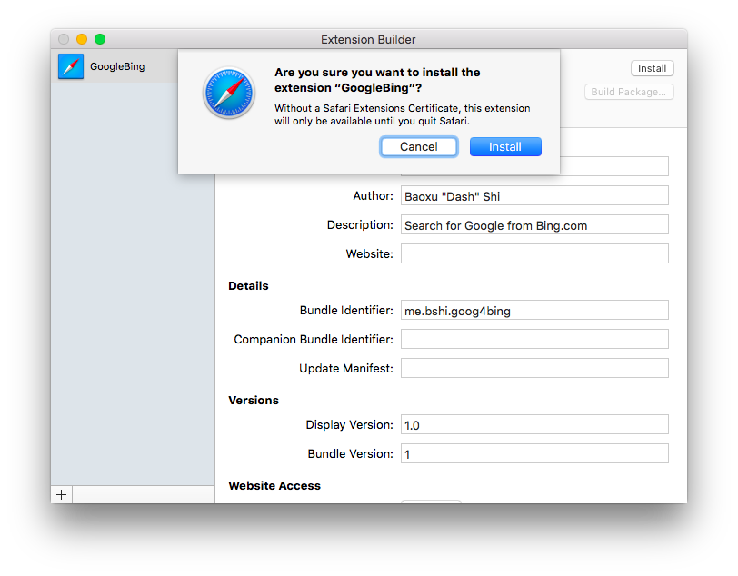

## googleBing

Google from Bing.com!


Bing.com is your default search engine and you really want to use Google? No
problem at all! Just install this and you will be only one click away from
Google.

## Install

`Thanks to Apple, I can not build an extension into a package unless I pay 99USD annually.`

First please clone this repo using

``` 
git clone https://github.com/bxshi/googleBing.git
```
then open `Safari` and select `Develop->Show Extension Builder`



you will see the `Extension Builder`



click the `+` on the left bottom and select `Add Extension`



go to the folder that you store this extension and click `select`



and then click `install` on the right top corner



there will be a popup warning, read and decide if you still want this extension



Now you are done! Try open `Bing.com` and search for something, there will be
a Google button next to the original search button, click on it to search the
exact words on Google.com!


